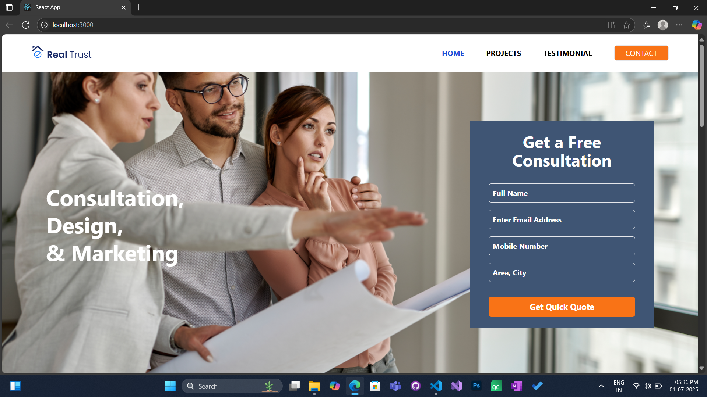
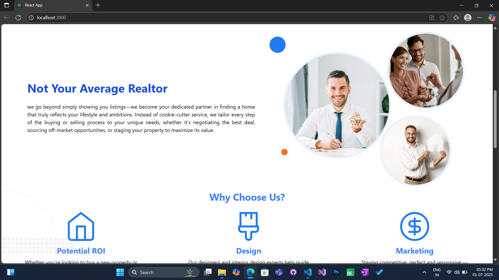
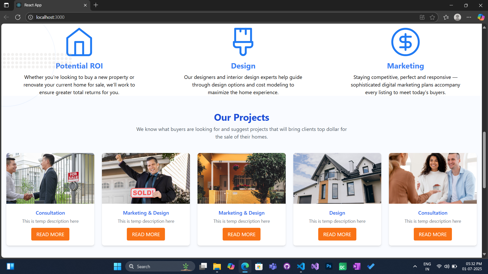
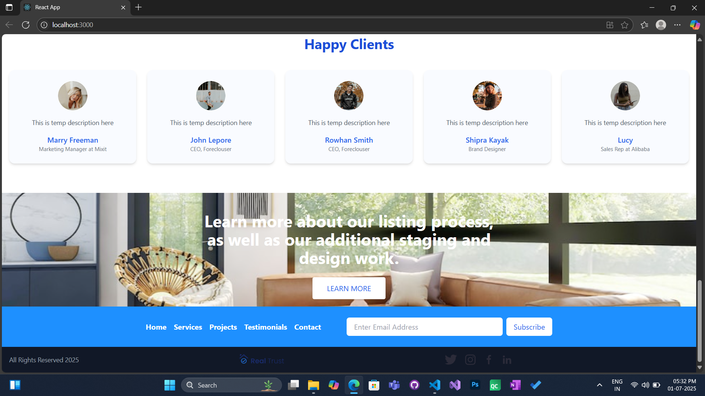

# 💼 my-solutions

A full-stack business website with a modern landing page and integrated admin panel.

## ✨ Features

### 🌐 Landing Page
- 🧩 **Our Projects** – showcase featured work dynamically (fetched from the Backend Server).
- 🤝 **Happy Clients** – highlight testimonials or partners (fetched from the Backend Server).
- ✉️ **Contact Form** – users can submit queries directly (Submits the form details to the Backend Server).
- 📬 **Newsletter Subscription** – collect email subscribers (Submits the email to the Backend Server in the 'Subscriber' Collection). 

### 🔐 Admin Panel
- 🛠️ Manage Projects and Clients
- 📄 View Contact Form Submissions
- 📧 View All Newsletter Subscriptions
- 🖼️ Upload and **Crop Images** before saving

## 🧰 Tech Stack
- **Frontend**: React.js, TailwindCSS
- **Backend**: Express.js
- **Database**: MongoDB

## 🚀 Deployment
Live link coming soon...

---

Stay tuned for updates!

